# Udacity Cloud Developer using Microsoft Azure Nanodegree Program - Project: Deploy the Neighborly App with Azure Functions

- [Introduction](#introduction)
- [Getting Started](#getting-started)
  - [Dependencies](#dependencies)
- [Instructions](#instructions)
  - [Creating Azure Function app](#creating-azure-function-app)
    - [Login with Azure CLI](#login-with-azure-cli)
    - [Create a Resource Group](#create-a-resource-group)
    - [Create a storage account](#create-a-storage-account)
    - [Create an Azure Function App](#create-an-azure-function-app)
    - [Set up a Cosmos DB Account](#set-up-a-cosmos-db-account)
    - [Create MongoDB database and collections](#create-mongodb-database-and-collections)
    - [Get connection string](#get-connection-string)
  - [Import sample data](#import-sample-data)
    - [Add connection string to API files](#add-connection-string-to-api-files)
    - [Deploy your Azure Functions](#deploy-your-azure-functions)
  - [Deploying the client-side Flask web application](#deploying-the-client-side-flask-web-application)
  - [CI/CD deployment](#cicd-deployment)
    - [Deploy your client app](#deploy-your-client-app)
    - [Create an Azure Container Registry](#create-an-azure-container-registry)
    - [Dockerize your Azure Functions](#dockerize-your-azure-functions)
    - [Push the container to the Azure Container Registry](#push-the-container-to-the-azure-container-registry)
    - [Create a Kubernetes Cluster](#create-a-kubernetes-cluster)
    - [Deploy app to Kubernetes](#deploy-app-to-kubernetes)
  - [Event Hubs and Logic App](#event-hubs-and-logic-app)
    - [Create a Logic App that watches for an HTTP trigger](#create-a-logic-app-that-watches-for-an-http-trigger)
    - [Create a namespace for event hub in the portal](#create-a-namespace-for-event-hub-in-the-portal)
    - [Add the connection string of the event hub to the Azure Function](#add-the-connection-string-of-the-event-hub-to-the-azure-function)
- [Clean-up](#clean-up)
- [Screenshots](#screenshots)
  - [Serverless Functions](#serverless-functions)
    - [Database](#database)
    - [Triggers in Azure](#triggers-in-azure)
    - [Triggers Connect to Database](#triggers-connect-to-database)
    - [Flask Front End: Localhost](#flask-front-end-localhost)
  - [Logic Apps & Event Hubs](#logic-apps--event-hubs)
    - [Logic App](#logic-app)
    - [Event Hub](#event-hub)
  - [Deploying Your Application](#deploying-your-application)
    - [App Service Deployment](#app-service-deployment)
    - [Dockerfile](#dockerfile)
    - [Kubernetes](#kubernetes)
- [References](#references)
- [Requirements](#requirements)
- [License](#license)

## Introduction

Neighborly is a Python Flask-powered web application that allows neighbors to post advertisements for services and products they can offer.

The Neighborly project is comprised of a front-end application that is built with the Python Flask micro framework. The application allows the user to view, create, edit, and delete the community advertisements.

The application makes direct requests to the back-end API endpoints. These are endpoints that we will also build for the server-side of the application.

You can see an example of the deployed app below:


## Getting Started

1. Clone this repository
2. Ensure you have all the dependencies
3. Follow the instructions below

### Dependencies

You will need to install the following locally:

- [Pipenv](https://pypi.org/project/pipenv/)
- [Visual Studio Code](https://code.visualstudio.com/download)
- [Azure Function tools V3](https://docs.microsoft.com/en-us/azure/azure-functions/functions-run-local?tabs=windows%2Ccsharp%2Cbash#install-the-azure-functions-core-tools)
- [Azure CLI](https://docs.microsoft.com/en-us/cli/azure/install-azure-cli?view=azure-cli-latest)
- [Azure Tools for Visual Studio Code](https://marketplace.visualstudio.com/items?itemName=ms-vscode.vscode-node-azure-pack)
- [MongoDB](https://docs.mongodb.com/manual/installation/)
- [kubectl](https://kubernetes.io/docs/tasks/tools/)

## Instructions

### Creating Azure Function app

#### Login with Azure CLI

This project uses your Azure user and the Azure CLI to login and execute commands:

```bash
az login
```

Check [Create an Azure service principal with the Azure CLI](https://docs.microsoft.com/en-us/cli/azure/create-an-azure-service-principal-azure-cli?view=azure-cli-latest) if you prefer using a service principal instead.

#### Create a Resource Group

Run the code below to create a new Resource Group:

```bash
az group create \
    --name neighborly-app-rg \
    --location eastus \
    --tags "dept=Engineering" \
    --tags "environment=Production" \
    --tags "project=Udacity Neighborly App" \
    --tags "createdby=CLI"
```

#### Create a storage account

Create a storage account (within the previously created resource group and region):

```bash
az storage account create \
    --name neighborlyst \
    --resource-group neighborly-app-rg \
    --location eastus
```

Then we create our container:

TBD: Is it required?

```bash
az storage container create \
    --account-name neighborlyst \
    --name images \
    --auth-mode login \
    --public-access container
```

#### Create an Azure Function App

Create an Azure Function App within the resource group, region and storage account:

```bash
az functionapp create \
    --name neighborly-api-v1 \
    --resource-group neighborly-app-rg \
    --storage-account neighborlyst \
    --functions-version 3 \
    --os-type Linux \
    --runtime python \
    --runtime-version 3.8 \
    --consumption-plan-location eastus
```

- Note that app names need to be unique across all of Azure
- Make sure it is a Linux app, with a Python runtime

#### Set up a Cosmos DB Account

You will need to use the same resource group, region and storage account, but can name the Cosmos DB account as you prefer:

```bash
COSMOS_ACCOUNT="neighborly-app-cosmos"
RESOURCE_GROUP="neighborly-app-rg"
REGION="eastus"

az cosmosdb create \
    --name $COSMOS_ACCOUNT \
    --resource-group $RESOURCE_GROUP \
    --kind MongoDB \
    --locations regionName=$REGION failoverPriority=0 isZoneRedundant=False
```

This step may take a little while to complete (15-20 minutes in some cases).

#### Create MongoDB database and collections

Create a MongoDB Database in CosmosDB Azure and two collections, one for `advertisements` and one for `posts`:

```bash
DATABASE_NAME="neighborly-app-cosmos-db"
CREATE_LEASE_COLLECTION=0 # yes,no=(1,0)

COLLECTION_ADS="advertisements"
COLLECTION_POSTS="posts"

az cosmosdb mongodb database create \
    --account-name $COSMOS_ACCOUNT \
    --name $DATABASE_NAME \
    --resource-group $RESOURCE_GROUP

az cosmosdb mongodb collection create \
    --resource-group $RESOURCE_GROUP \
    --account-name $COSMOS_ACCOUNT \
    --database-name $DATABASE_NAME \
    --name $COLLECTION_ADS \
    --throughput 400

az cosmosdb mongodb collection create \
    --resource-group $RESOURCE_GROUP \
    --account-name $COSMOS_ACCOUNT \
    --database-name $DATABASE_NAME \
    --name $COLLECTION_POSTS \
    --throughput 400
```

#### Get connection string

Copy/paste the primary connection string, it will be used later in the application:

```bash
az cosmosdb keys list \
    --name $COSMOS_ACCOUNT \
    --resource-group $RESOURCE_GROUP \
    --type connection-strings
```

### Import sample data

Import the data from the `sample_data` directory for ads and posts to initially fill your app:

```bash
MONGODB_HOST="$COSMOS_ACCOUNT.mongo.cosmos.azure.com"
MONGODB_PORT="10255"

# Copy/past the primary password here
PRIMARY_PW="MJFwUScqM9g1MoFeoSb5IbTOfIoXkMLvMCfeQSkeLqiiLVHHiGbpqm2oysFQa5oueRQifbyv1QT7JBuayDIkrQ=="

mongoimport -h $MONGODB_HOST:$MONGODB_PORT \
    --writeConcern="{w:0}" \
    -d $DATABASE_NAME \
    -c $COLLECTION_ADS \
    -u $COSMOS_ACCOUNT \
    -p $PRIMARY_PW \
    --ssl --jsonArray --file sample_data/sampleAds.json

mongoimport -h $MONGODB_HOST:$MONGODB_PORT \
    --writeConcern="{w:0}" \
    -d $DATABASE_NAME \
    -c $COLLECTION_POSTS \
    -u $COSMOS_ACCOUNT \
    -p $PRIMARY_PW \
    --ssl --jsonArray --file sample_data/samplePosts.json
```

You can get the primary password from the Azure Portal on the Azure Cosmos DB settings ("Connection String").

#### Add connection string to API files

You need to hook up your connection string into the NeighborlyAPI server folder. You will need to replace the _url_ variable with your own connection string you copy-and-pasted in the last step, along with some additional information. Check out [this post](https://docs.microsoft.com/en-us/azure/cosmos-db/connect-mongodb-account) if you need help with what information is needed.

Go to each of the `__init__.py` files in `getPosts`, `getPost`, `getAdvertisements`, `getAdvertisement`, `deleteAdvertisement`, `updateAdvertisement`, `createAdvertisements` and replace your connection string. You will also need to set the related `database` and `collection` appropriately.

#### Deploy your Azure Functions

Test it out locally first. To do so, you have to install the dependencies:

```bash
pipenv install
pipenv shell
```

Switch to the API folder, fetch the app settings and run the functions locally:

```bash
cd NeighborlyAPI
```

Fetch app settings:

```bash
func azure functionapp fetch-app-settings neighborly-api-v1
```

Add connection string to `local.settings.json`:

```bash
{
  "IsEncrypted": true,
  "Values": {
    "FUNCTIONS_WORKER_RUNTIME": "<from fetch-app-settings>".
    "FUNCTIONS_EXTENSION_VERSION": "<from fetch-app-settings>".
    "AzureWebJobsStorage": "<from fetch-app-settings>".
    "APPINSIGHTS_INSTRUMENTATIONKEY": "<from fetch-app-settings>".
    "MongoDBConnectionString": "", # TODO: set your MongoDB connection string
  },
  "ConnectionStrings": {}
}
```

Run functions locally:

```bash
func start
```

You may need to change `"IsEncrypted"` to `false` in `local.settings.json` if this fails.

At this point, Azure functions are hosted in [localhost:7071](http://localhost:7071). For example:

- [http://localhost:7071/api/getAdvertisements](http://localhost:7071/api/getAdvertisements)
- [http://localhost:7071/api/getPosts](http://localhost:7071/api/getPosts)

If everything works, you can deploy the functions to Azure by publishing your function app:

```bash
func azure functionapp publish neighborly-api-v1
```

Add the MongoDB connection string as a new application setting in your function app:

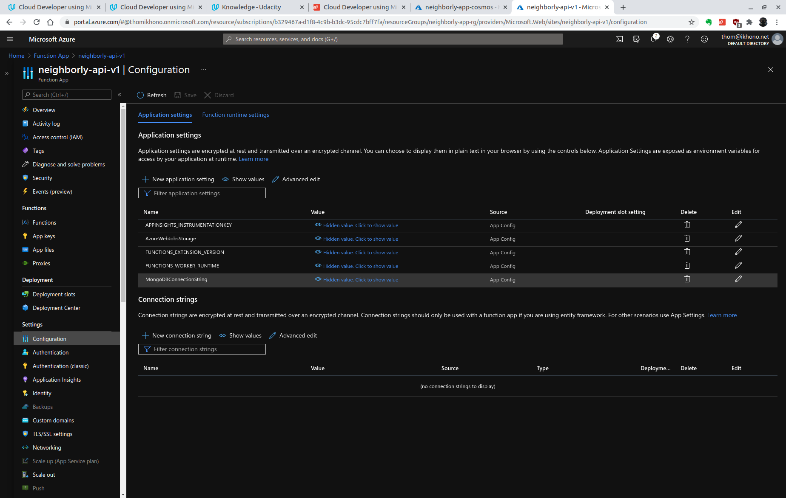

Save the function app url [https://neighborly-api-v1.azurewebsites.net/api/](https://neighborly-api-v1.azurewebsites.net/api/) since you will need to update that in the client-side of the application.

### Deploying the client-side Flask web application

We are going to update the Client-side `settings.py` with published API endpoints. First navigate to the `settings.py` file in the `NeighborlyFrontEnd/` directory.

Use a text editor to update the API_URL to your published url from the last step:

```bash
# Inside file settings.py

# ------- For Local Testing -------
#API_URL = "http://localhost:7071/api"

# ------- For production -------
# where APP_NAME is your Azure Function App name
API_URL="https://neighborly-api-v1.azurewebsites.net/api"
```

### CI/CD deployment

#### Deploy your client app

Use a different app name here to deploy the front-end, or else you will erase your API. From within the `NeighborlyFrontEnd` directory:

- Install dependencies with `pipenv install`
- Go into the pip env shell with `pipenv shell`
- Deploy your application to the app service:

  ```bash
  az webapp up \
    --sku F1 \
    --name neighborly-app \
    --resource-group neighborly-app-rg \
    --location eastus
  ```

- If you want to update your app, make changes to your code and then run:

  ```bash
  az webapp up \
    --name neighborly-app \
    --verbose
  ```

Make sure to also provide any necessary information in `settings.py` to move from localhost to your deployment (see [above](#deploying-the-client-side-flask-web-application)).

#### Create an Azure Container Registry

Create an Azure Container Registry to dockerize your Azure Functions:


Instead of the Azure Portal, you can also use the Azure CLI:

```bash
az acr create \
    --resource-group neighborly-app-rg \
    --name neighborlyappcr \
    --sku Basic
```

This create the Azure Container Registry `neighborlyappcr.azurecr.io`.

#### Dockerize your Azure Functions

Switch to your Azure Functions folder and create a Docker file with the following command:

```bash
func init --docker-only
```

Then build the Docker image:

```bash
docker build -t neighborly-app-image:v1 .
```

Test the image locally.

```bash
docker run -e MongoDBConnectionString=<MongoDBConnectionString> -p8080:80 neighborly-app-image:v1
```

#### Push the container to the Azure Container Registry

To use the ACR instance, you must first log in:

```bash
az acr login --name neighborlyappcr
```

Now, tag your local image with the ARC server address. To indicate the image version, add `:v1` to the end of the image name:

```bash
docker tag neighborly-app-image:latest neighborlyappcr.azurecr.io/neighborly-app-image:v1
```

With your image built and tagged, push it to your ACR instance:

```bash
docker push neighborlyappcr.azurecr.io/neighborly-app-image:v1
```

Confirm the image has been stored on the ARC instance:

```bash
az acr repository list --name neighborlyappcr --output table
az acr repository show-tags --name neighborlyappcr --repository neighborly-app-image --output table
```

#### Create a Kubernetes Cluster

Create a Kubernetes cluster:

```bash
az aks create \
    --resource-group neighborly-app-rg \
    --name neighborlyappaks \
    --node-count 2 \
    --generate-ssh-keys \
    --attach-acr neighborlyappcr
```

To configure `kubectl` to connect to your Kubernetes cluster, use the `az aks get-credentials` command:

```bash
az aks get-credentials \
    --name neighborlyappaks \
    --resource-group neighborly-app-rg
```

To verify the connection to your cluster, run the `kubectl get nodes` command to return a list of the cluster nodes:

```bash
kubectl get nodes
```

If everything worked, you should output similar to:

```bash
NAME                                STATUS   ROLES   AGE   VERSION
aks-nodepool1-08854386-vmss000000   Ready    agent   93s   v1.18.14
aks-nodepool1-08854386-vmss000001   Ready    agent   92s   v1.18.14
```

#### Deploy app to Kubernetes

KEDA is Google's opensource tool for Kubernetes event-driven Autoscaling. Let's set up the KEDA namespace for our Kubernetes cluster:

```bash
func kubernetes install --namespace keda
```

Now we are ready to deploy. First do a dry run and write deploy YAML file:

```bash
func kubernetes deploy \
    --name neighborly-app \
    --image-name neighborlyappcr.azurecr.io/neighborly-app-image:v1 \
    --dry-run > deploy.yml
```

Now we are ready to do the deployment:

```bash
func kubernetes deploy \
    --name neighborly-app \
    --image-name neighborlyappcr.azurecr.io/neighborly-app-image:v1 \
    --polling-interval 3 \
    --cooldown-period 5

kubectl apply -f deploy.yml
```

The output should be similar to this:

```bash
deployment "neighborly-app-http" successfully rolled out
    createAdvertisement - [httpTrigger]
    Invoke url: http://20.185.103.38/api/createadvertisement

    deleteAdvertisement - [httpTrigger]
    Invoke url: http://20.185.103.38/api/deleteadvertisement

    getAdvertisement - [httpTrigger]
    Invoke url: http://20.185.103.38/api/getadvertisement

    getAdvertisements - [httpTrigger]
    Invoke url: http://20.185.103.38/api/getadvertisements

    getPost - [httpTrigger]
    Invoke url: http://20.185.103.38/api/getpost

    getPosts - [httpTrigger]
    Invoke url: http://20.185.103.38/api/getposts

    updateAdvertisement - [httpTrigger]
    Invoke url: http://20.185.103.38/api/updateadvertisement
```

Check your deployment with `kubectl config get-contexts`:

```bash
CURRENT   NAME               CLUSTER            AUTHINFO                                         NAMESPACE
*         neighborlyappaks   neighborlyappaks   clusterUser_neighborly-app-rg_neighborlyappaks
```

Check PODs and services:

```bash
kubectl get pods
kubectl get services
```

### Event Hubs and Logic App

#### Create a Logic App that watches for an HTTP trigger

With Azure Logic Apps and the SendGrid connector, you can automate tasks and workflows that send emails. We will utilize SendGrid with the Logic App Designer to be able to send emails when a new ad is added.

1. Create a SendGrid account [here](https://sendgrid.com/). You can use the free service in this exercise, which is enough for our purposes.
2. Login and generate a SendGrid key
   - Your API key is located [here](https://app.sendgrid.com/settings/api_keys).
   - Save it down and keep it safe, since that will be used to send emails later on. You will only see this once.
3. Next, you'll use the Logic App Designer with an HTTP Trigger:
   - Login to the Azure Portal.
   - Go to Resources and create a Logic App.
   - Select Blank Logic Apps template.
   - In the search box, search for "http". Select HTTP.
4. Use Neighborly app URLs.
5. Then, click on New step and configure your SendGrid email. Add a new connection using the API key from earlier.
6. Fill in the missing to/from and body fields for the email. For the subject, write "test from logic app designer", or whatever subject you would like.

Instead of creating a SendGrid account, you can also use Gmail or Outlook.com.

#### Create a namespace for event hub in the portal

1. Create a new Event Hub Namespace in the Azure Portal:

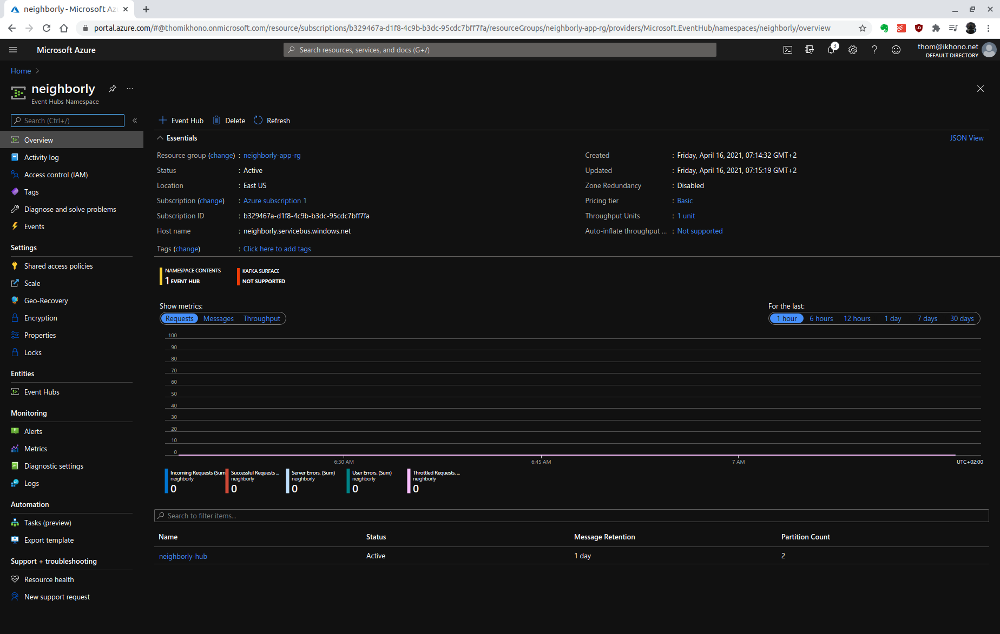

2. Create a new Event Hub in the Namespace:

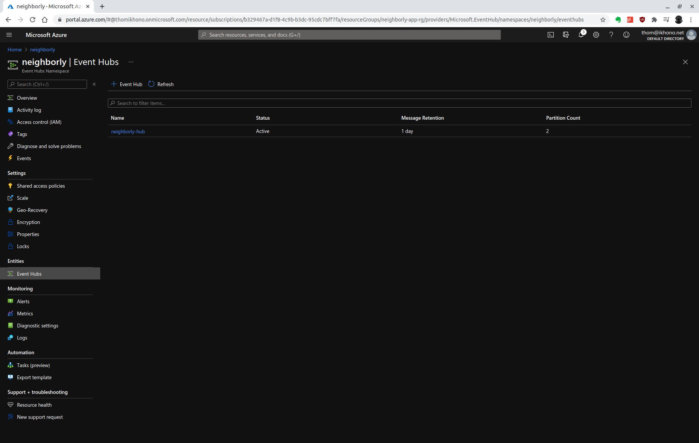

#### Add the connection string of the event hub to the Azure Function

1. Add a new share access policy

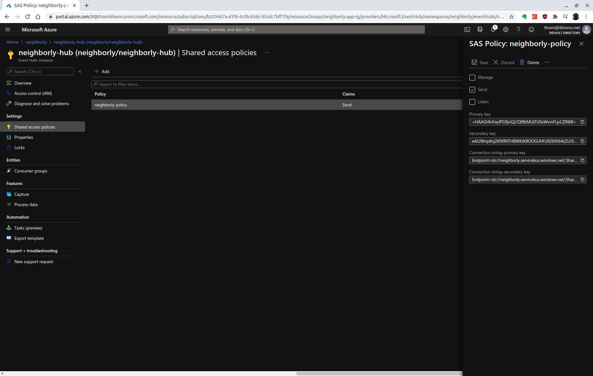

2. Add the connection string to the `eventHubTrigger` Azure Function `function.json`:

    ```json
    {
    "scriptFile": "__init__.py",
    "bindings": [
        {
        "type": "eventGridTrigger",
        "name": "event",
        "direction": "in",
        "eventHubName": "testhub", 
        "connection": "Endpoint=sb://neighborly.servicebus.windows.net/;SharedAccessKeyName=neighborly-policy;SharedAccessKey=+HAAGHlnFayIPG9jnQ2/Qf9kMUJFU0xWvmFLjvLZRW8=;EntityPath=neighborly-hub"
        }
    ]
    }
    ```

## Clean-up

Clean up and remove all services, or else you will incur charges:

```bash
az group delete --name neighborly-app-rg
```

## Screenshots

### Serverless Functions

#### Database

A screenshot from the Azure portal showing the database & collections:

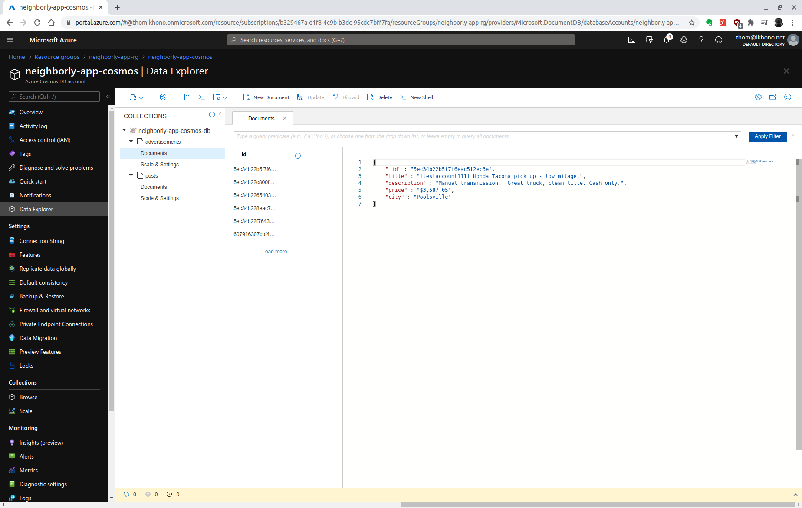

A screenshot from the terminal giving confirmation that the two pieces of sample data for advertisements (5 documents) and posts (4 documents) were imported correctly and include this data in the live website:

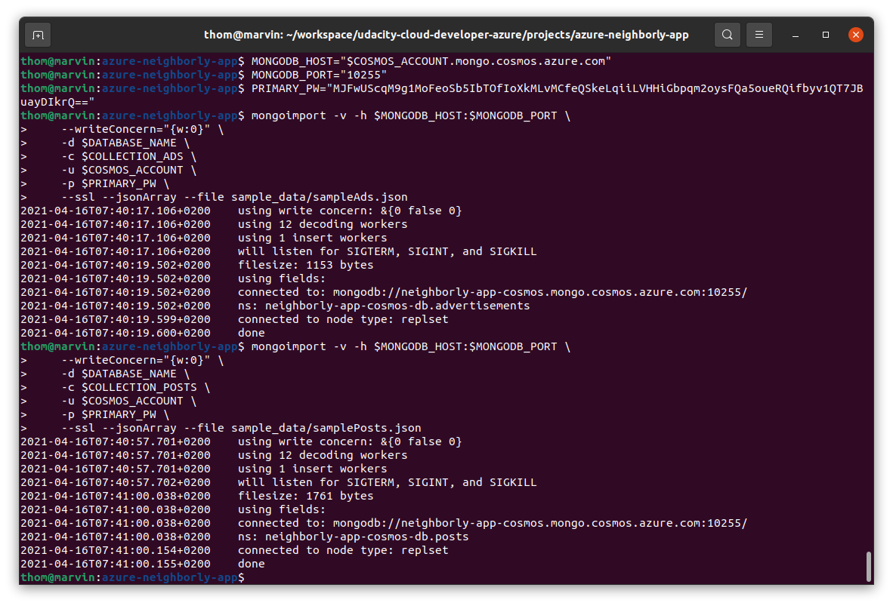

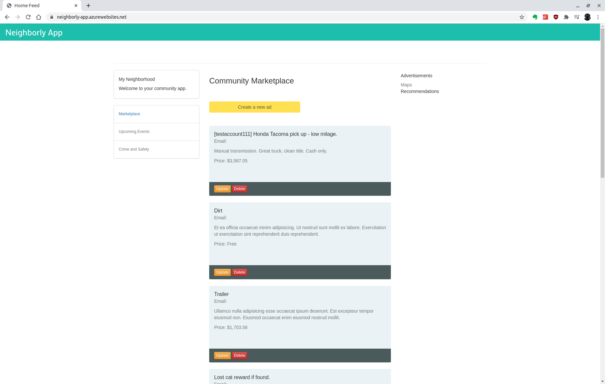

#### Triggers in Azure

A screenshot, including URL, from the Azure portal where it is shown what endpoints are live:

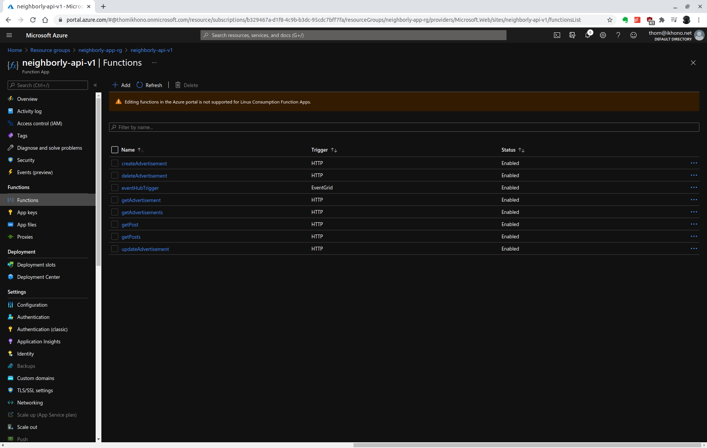

#### Triggers Connect to Database

A screenshot, including URL, of at least the data returned from querying the getAdvertisements endpoint:

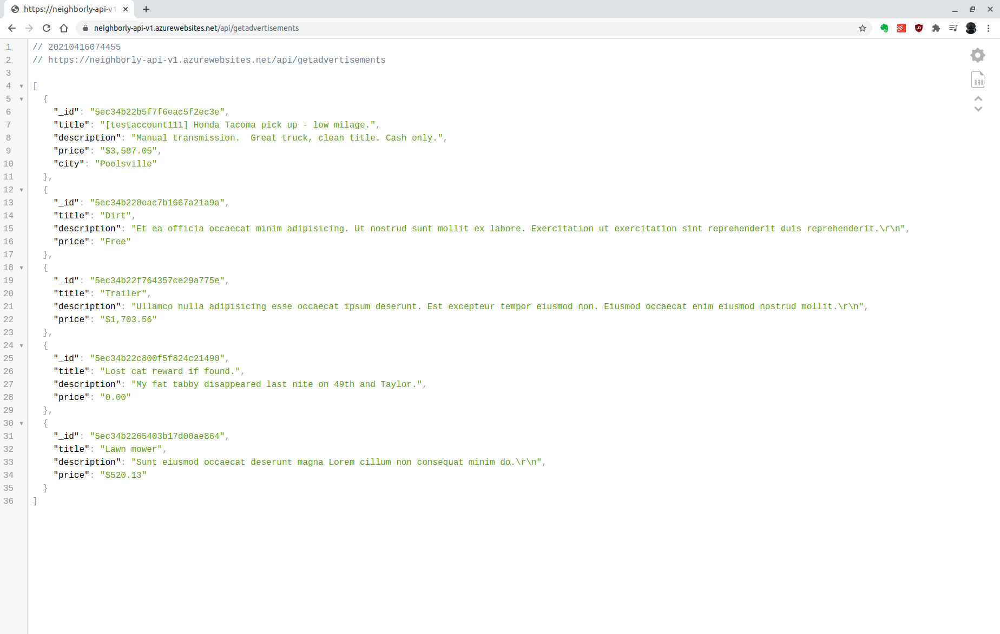

#### Flask Front End: Localhost

A screenshot of the front-end appropriately pulling up posts when you visit localhost:

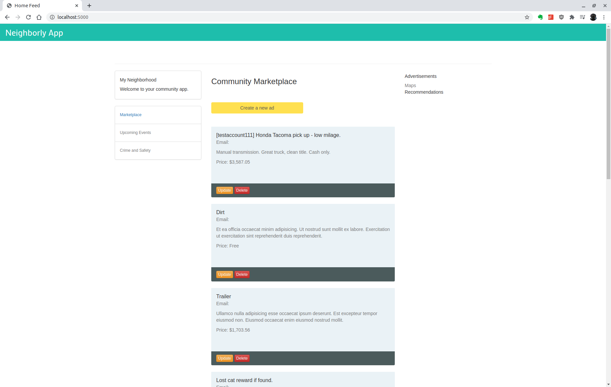

### Logic Apps & Event Hubs

#### Logic App

A screenshot from your inbox notification:

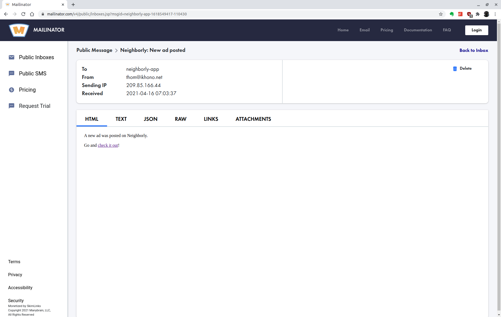

#### Event Hub

A screenshot with the namespace URL:


### Deploying Your Application

#### App Service Deployment

A screenshot of the live site:


#### Dockerfile

A screenshot of the Dockerfile from Azure Container Registry:

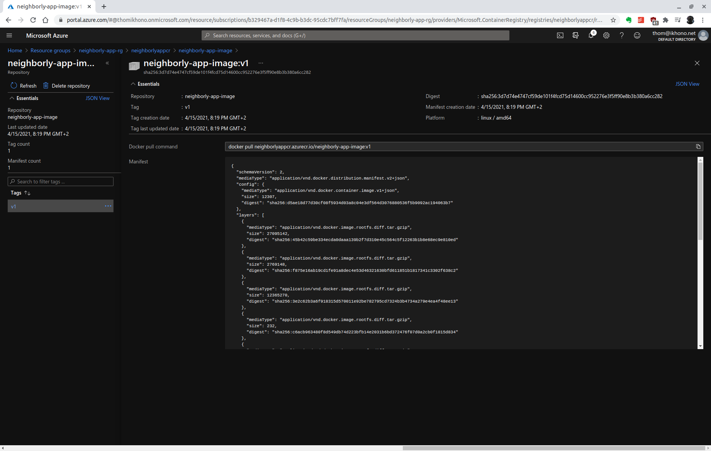

#### Kubernetes

A screenshot of confirmation from the terminal, or from within Azure:

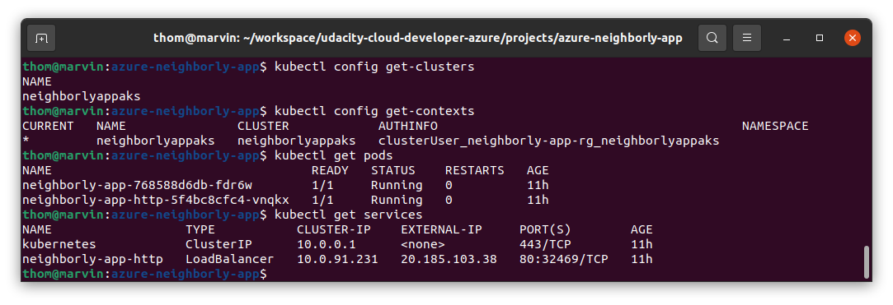

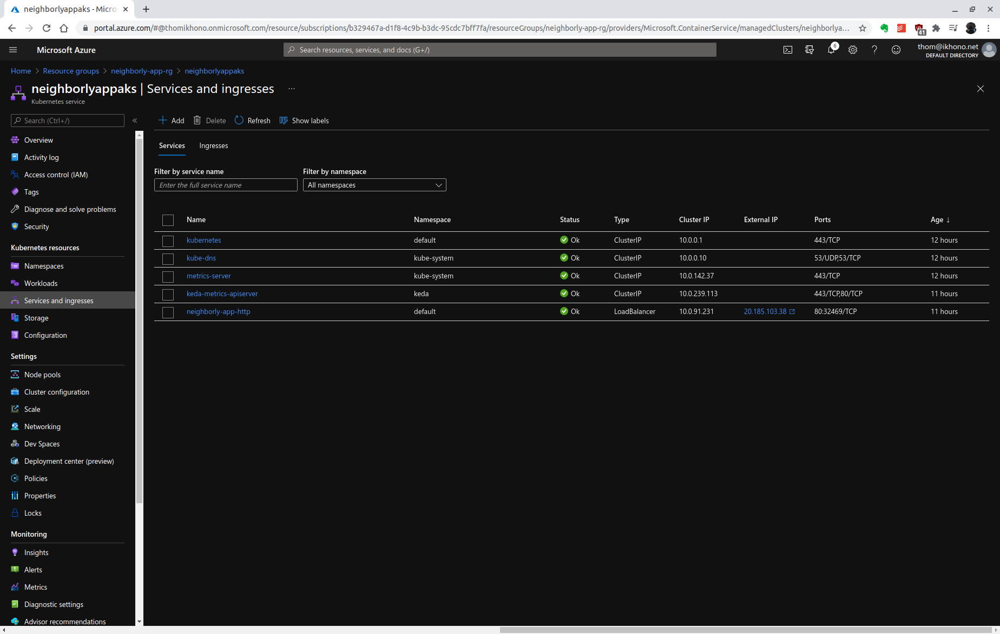

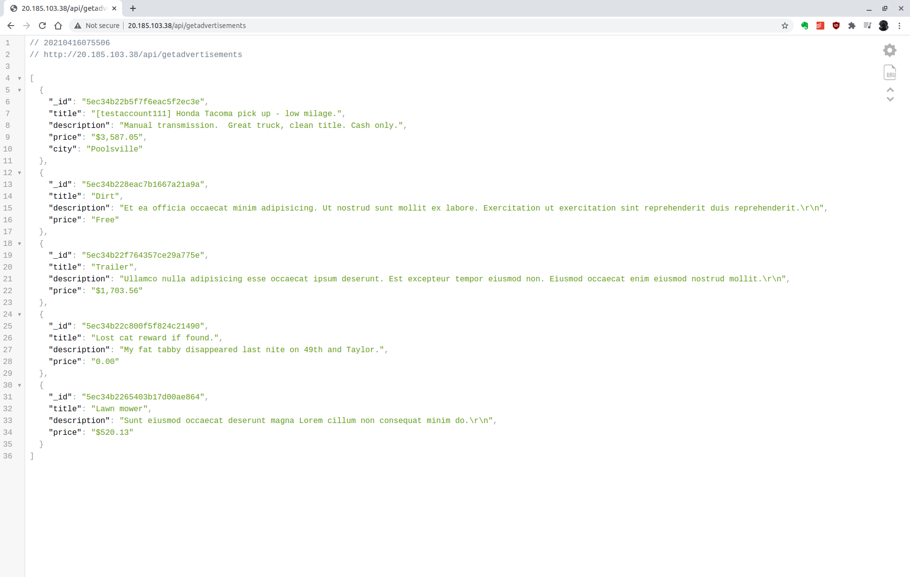

## References

- [Develop, test, and deploy an Azure Function with Visual Studio](https://docs.microsoft.com/en-us/learn/modules/develop-test-deploy-azure-functions-with-visual-studio)
- [Work with NoSQL data in Azure Cosmos DB](https://docs.microsoft.com/en-us/learn/paths/work-with-nosql-data-in-azure-cosmos-db)
- [Build and store container images with Azure Container Registry](https://docs.microsoft.com/en-us/learn/modules/build-and-store-container-images)
- [Run Docker containers with Azure Container Instances](https://docs.microsoft.com/en-us/learn/modules/run-docker-with-azure-container-instances)
- [Deploy and run a containerized web app with Azure App Service](https://docs.microsoft.com/en-us/learn/modules/deploy-run-container-app-service)

## Requirements

Graded according to the [Project Rubric](https://review.udacity.com/#!/rubrics/2825/view).

## License

- **[MIT license](http://opensource.org/licenses/mit-license.php)**
- Copyright 2021 © [Thomas Weibel](https://github.com/thom).
